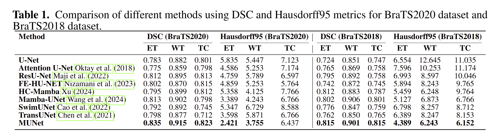

# Coming Soon to Open Source: MUNet

## OverView

Brain tumors are one of the major health threats to humans, and their complex pathological features and anatomical structures make accurate segmentation and detection crucial. However, existing models based on Transformers and Convolutional Neural Networks (CNNs) still have limitations in medical image processing. While Transformers are proficient in capturing global features, they suffer from high computational complexity and require large amounts of data for training. On the other hand, CNNs perform well in extracting local features but have limited performance when handling global information. To address these issues, this paper proposes a novel network framework, MUNet, which combines the advantages of UNet and Mamba, specifically designed for brain tumor segmentation. MUNet introduces the SD-SSM module, which effectively captures both global and local features of the image through selective scanning and state-space modeling, significantly improving segmentation accuracy. Additionally, we design the SD-Conv structure, which reduces feature redundancy without increasing model parameters, further enhancing computational efficiency. Finally, we propose a new loss function that combines mIoU loss, Dice loss, and Boundary loss, which improves segmentation overlap, similarity, and boundary accuracy from multiple perspectives. Experimental results show that, on the BraTS2020 dataset, MUNet achieves DSC values of 0.835, 0.915, and 0.823 for enhancing tumor (ET), whole tumor (WT), and tumor core (TC), respectively, and Hausdorff95 scores of 2.421, 3.755, and 6.437. On the BraTS2018 dataset, MUNet achieves DSC values of 0.815, 0.901, and 0.815, with Hausdorff95 scores of 4.389, 6.243, and 6.152, all outperforming existing methods and achieving significant performance improvements. Furthermore, when validated on the independent LGG dataset, MUNet demonstrated excellent generalization ability, proving its effectiveness in various medical imaging scenarios.

  

# Project Setup and Requirements

To set up the environment for this project, follow the steps below:


The first step is to create a Conda environment specifically for this project. This helps to ensure that the project dependencies are isolated and do not interfere with other Python projects or system-wide libraries.

You can create a Conda environment named `MUNet` by running the following command in your terminal or command prompt:

```bash
conda env create -f environment.yaml
conda activate MUNet
```
## Data Availability

The following datasets are used for training, validation, and evaluation of the MUNet model. These datasets provide various medical imaging data, particularly for brain tumor segmentation, and can be accessed via Kaggle.

1. **BraTS2020 Dataset (Training & Validation)**
   - **Description**: The BraTS2020 dataset contains MRI scans for brain tumor segmentation. It includes both low-grade and high-grade gliomas with multimodal imaging (T1, T2, FLAIR, and post-contrast T1 images). The dataset is used for evaluating the performance of segmentation models in terms of tumor region delineation.
   - **Link**: [BraTS2020 Dataset on Kaggle](https://www.kaggle.com/datasets/awsaf49/brats20-dataset-training-validation)

2. **BraTS2018 Dataset**
   - **Description**: The BraTS2018 dataset provides additional MRI scan data with tumor regions labeled for segmentation. It consists of high-resolution MRI images with corresponding ground truth labels for tumor regions (enhancing tumor, whole tumor, and tumor core) to evaluate segmentation algorithms.
   - **Link**: [BraTS2018 Dataset on Kaggle](https://www.kaggle.com/datasets/anassbenfares/brats2018)

3. **LGG Segmentation Dataset**
   - **Description**: This dataset focuses on Low-Grade Glioma (LGG) MRI scans, a specific type of brain tumor. The dataset includes MRI scans with detailed segmentations, which are used to evaluate segmentation performance in low-grade glioma detection and analysis.
   - **Link**: [LGG Segmentation Dataset on Kaggle](https://www.kaggle.com/datasets/mateuszbuda/lgg-mri-segmentation)


## Reuslts




