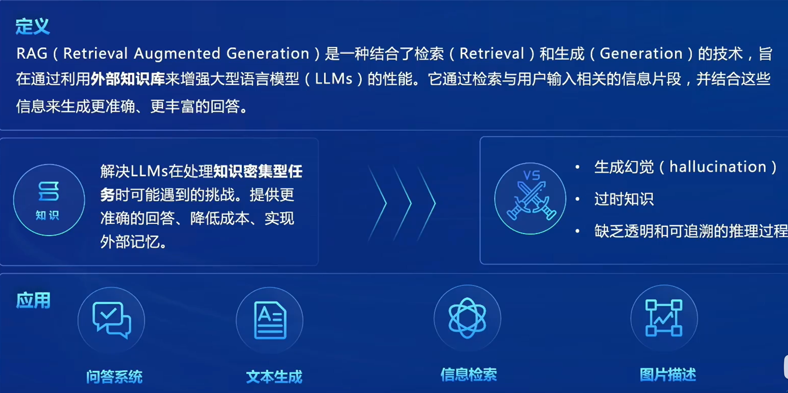
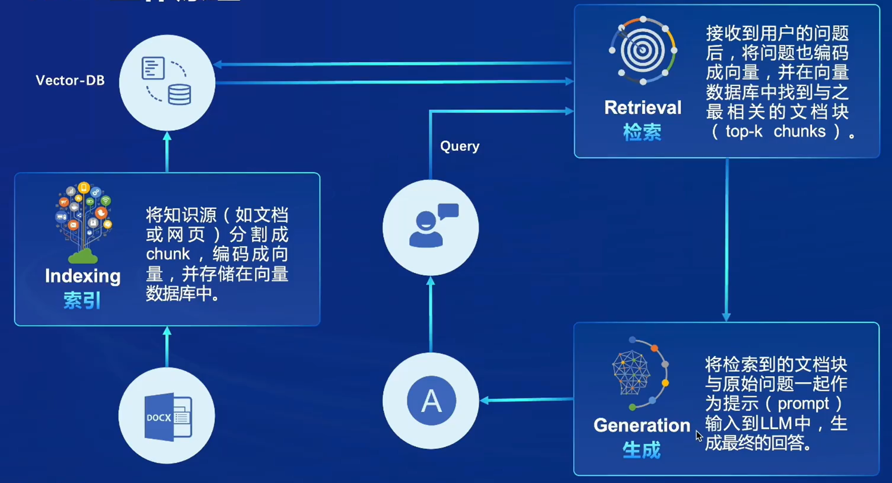
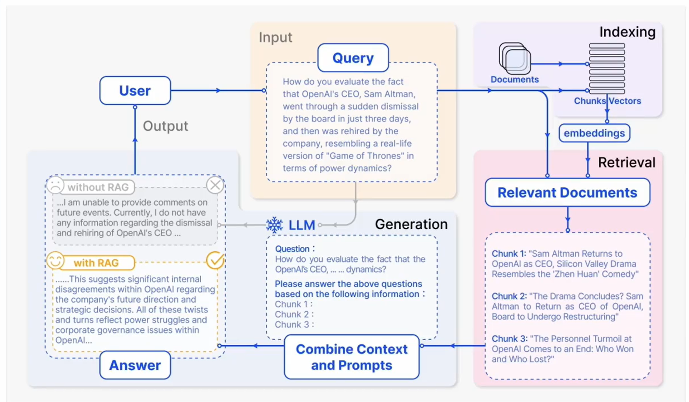

# RAG

### 什么是RAG

**可以将RAG理解一个成一个搜索引擎，用户输入的内容作为一个索引，在外部库中搜索相应的内容，最终结合大语言的能力生成回答**

### 三个步骤：检索、索引、生成

### 向量数据库

### 事例流程

### 步骤一：

#### 安装依赖

1. 激活conda环境：
- source ~/.bashrc

2. 创建一个名字为RAG的环境
- conda create -n RAG python==3.10 -y
- conda activate RAG

3. 下载cuda和tourch

**https://pytorch.org/get-started/previous-versions/**

- conda install pytorch==2.0.1 torchvision==0.15.2 torchaudio==2.0.2 pytorch-cuda=11.7 -c pytorch -c nvidia
- pip install huggingface-hub==0.17.3 transformers==4.34 psutil==5.9.8 accelerate==0.24.1 streamlit==1.32.2 matplotlib==3.8.3 modelscope==1.9.5 sentencepiece==0.1.99

4. 下载安装茴香豆所需要的依赖

- pip install protobuf==4.25.3 accelerate==0.28.0 aiohttp==3.9.3 auto-gptq==0.7.1 bcembedding==0.1.3 beautifulsoup4==4.8.2 einops==0.7.0 faiss-gpu==1.7.2 langchain==0.1.14 loguru==0.7.2 lxml_html_clean==0.1.0 openai==1.16.1 openpyxl==3.1.2 pandas==2.2.1 pydantic==2.6.4 pymupdf==1.24.1 python-docx==1.1.0 pytoml==0.1.21 readability-lxml==0.8.1 redis==5.0.3 requests==2.31.0 scikit-learn==1.4.1.post1 sentence_transformers==2.2.2 textract==1.6.5 tiktoken==0.6.0 transformers==4.39.3 transformers_stream_generator==0.0.5 unstructured==0.11.2

                                                                                                                                                                                                                                                                                                                                                                                                                                                                       

